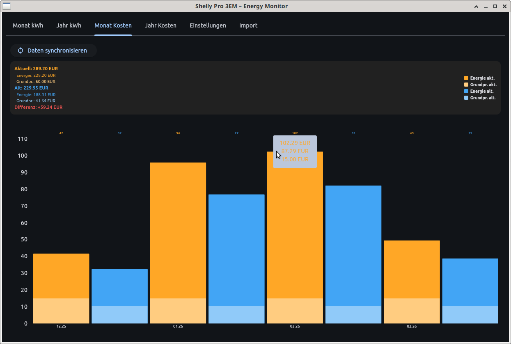

# Shelly Energy Monitor

**Deutsch** | [English below](#english)

---

## Deutsch

### Was ist das?

Shelly Energy Monitor ist eine einfache App zur Auswertung deines **Shelly Pro 3EM** Energiezählers.
Sie zeigt Verbrauch und Einspeisung deiner Solaranlage übersichtlich als Monats- und Jahresdiagramme an
und vergleicht deinen aktuellen Stromtarif mit einem alternativen Tarif.

Die App läuft auf **Windows, Linux und Android** – ohne Cloud, ohne Abo, ohne Internetverbindung.
Alle Daten bleiben lokal auf deinem Gerät.

---

### Voraussetzungen

- Ein **Shelly Pro 3EM** im Heimnetz
- **Wichtig:** Das Gerät (PC, Laptop oder Handy), auf dem die App läuft, muss sich im **selben Netzwerk (WLAN oder LAN)** befinden wie der Shelly-Zähler. Eine Verbindung über ein fremdes Netz oder VPN funktioniert in der Regel nicht.
- Python 3.9 oder neuer (nur bei manueller Installation)

---

### Screenshot



### Installation

Die fertige APK für Android sowie die ausführbaren Dateien für Windows und Linux befinden sich im Ordner `build/`.

Für die manuelle Ausführung direkt aus dem Quellcode:

```bash
pip install flet requests
python main.py
```

---

### Erste Schritte

1. App starten
2. Den Tab **Settings** öffnen
3. Entweder die IP-Adresse deines Shelly Pro 3EM eingeben und mit Enter bestätigen,
   oder auf **Search Shelly** klicken – die App sucht dann automatisch im Netzwerk
4. Sobald der Shelly gefunden wurde, auf **Sync data** klicken, um die Messdaten zu laden
5. Die Diagramme werden automatisch befüllt

---

### Einstellungen

| Feld | Bedeutung |
|------|-----------|
| Shelly IP | IP-Adresse des Shelly Pro 3EM im Heimnetz |
| Purchase price per kWh | Dein aktueller Bezugspreis in EUR/kWh |
| Feed-in compensation/kWh | Einspeisevergütung in EUR/kWh (0 wenn keine) |
| Base price/month | Monatlicher Grundpreis deines Tarifs |
| Alt. purchase price/kWh | Bezugspreis eines Vergleichstarifs |
| Alt. base price/month | Grundpreis des Vergleichstarifs |
| Currency | Währungszeichen für die Anzeige |

---

### Datenmigration

Falls du bereits eine ältere Version der App genutzt hast, kannst du deine bestehende Datenbank
über den Tab **Import** in das neue Format übertragen.

---

### Lizenz

MIT License – siehe [LICENSE](LICENSE)
Frei nutzbar, auch für kommerzielle Zwecke, solange der ursprüngliche Autorenhinweis erhalten bleibt.

---

## English

### What is this?

Shelly Energy Monitor is a straightforward app for analysing your **Shelly Pro 3EM** energy meter.
It displays consumption and feed-in data from your solar installation as monthly and yearly bar charts,
and compares your current electricity tariff against an alternative one.

The app runs on **Windows, Linux and Android** – no cloud, no subscription, no internet connection required.
All data stays locally on your device.

---

### Requirements

- A **Shelly Pro 3EM** on your home network
- **Important:** The device running this app (PC, laptop or phone) must be connected to the **same network (Wi-Fi or LAN)** as the Shelly meter. Connections via a separate network or VPN will generally not work.
- Python 3.9 or higher (manual installation only)

---

### Screenshot


### Installation

The ready-to-use APK for Android and the executables for Windows and Linux can be found in the `build/` folder.

To run the app manually from source:

```bash
pip install flet requests
python main.py
```

---

### Getting started

1. Launch the app
2. Open the **Settings** tab
3. Either enter the IP address of your Shelly Pro 3EM and confirm with Enter,
   or click **Search Shelly** to let the app scan your network automatically
4. Once the Shelly has been found, click **Sync data** to fetch the measurements
5. The charts will populate automatically

---

### Settings

| Field | Description |
|-------|-------------|
| Shelly IP | IP address of the Shelly Pro 3EM on your home network |
| Purchase price per kWh | Your current electricity purchase price in EUR/kWh |
| Feed-in compensation/kWh | Feed-in tariff in EUR/kWh (0 if none) |
| Base price/month | Monthly base charge of your tariff |
| Alt. purchase price/kWh | Purchase price of a comparison tariff |
| Alt. base price/month | Base charge of the comparison tariff |
| Currency | Currency symbol used in the display |

---

### Data migration

If you have used an older version of this app, you can import your existing database
into the new format using the **Import** tab.

---

### License

MIT License – see [LICENSE](LICENSE)
Free to use, including for commercial purposes, as long as the original copyright notice is retained.